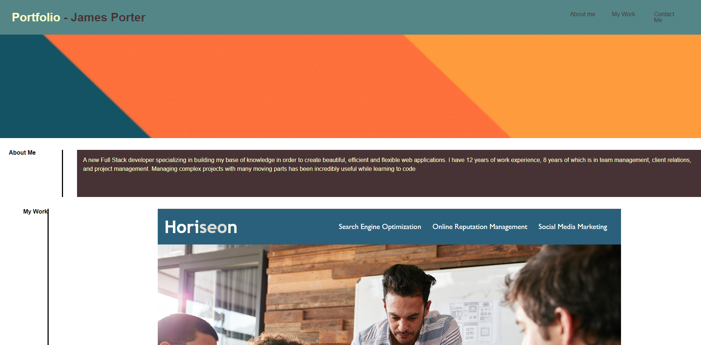

# Portfolio - James Porter

## Description

A brief front end web application designed to show my body of work. 

- To share my body of work with potential employers and colleagues.  
- I built this project to practice my front end web design and to begin crafying a useable and professional portfolio. 

## Usage

First, click the following link: https://jamesjporter.github.io/Portfolio-James-Porter/

Once you have arrived at the app, you may choose from one of three nav items to quickly traverse the apps content. If you hover over the first portfolio item, "Efficient Horizon" you will notice a brief hover effect. Clicking this item will open a link to the deployed portfolio item. 

Scrolling to the bottom fo the page reveals contact information. 

Link to live repo: https://github.com/JamesJPorter/Portfolio-James-Porter

    

## Credits

Primary engineer: James Porter
With assistance from: Sofia Tejada, Sandrine Poissonnet and Erik Chan